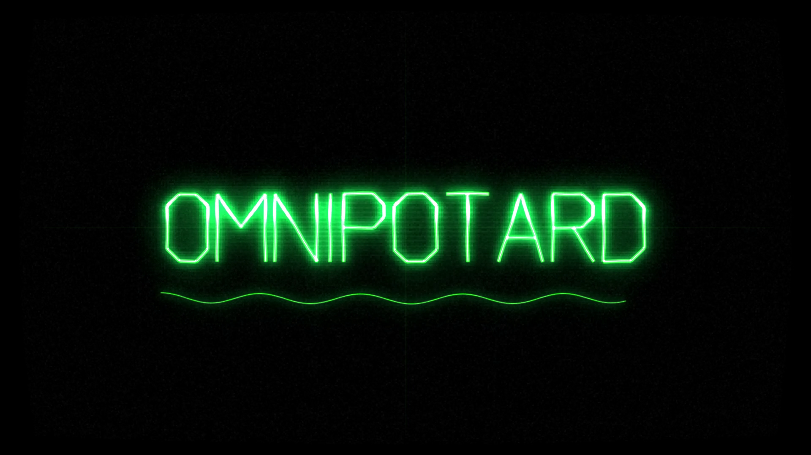

# Glitch-visualisateur — intro OMNIPOTARD

Générateur d'une intro vidéo « oscilloscope » (vert fluo sur noir) pour les clips
**Omnipotard** : un balayage d'oscillateur dessine une MPC, puis le titre se
reforme à partir de sinusoïdes.



## Le déroulé (10 s, 1920×1080, 60 fps)

| temps | séquence | ce qui se passe |
|---|---|---|
| 0,00 – 0,85 s | **amorce** | le réticule s'allume, la trace se stabilise sur la ligne de base |
| 0,85 – 4,20 s | **balayage** | le faisceau balaie l'écran de gauche à droite ; l'onde de l'oscillateur s'écrase au fur et à mesure et **laisse derrière elle le tracé de la MPC** (châssis, écran, molette, potards, touches, grille de 16 pads) |
| 4,20 – 5,60 s | **groove** | les pads s'allument sur un motif de 16 pas, l'écran affiche la forme d'onde |
| 5,60 – 6,55 s | **dissolution** | la machine fond en trois sinusoïdes |
| 6,55 – 8,40 s | **titre** | le texte, d'abord *déroulé* le long des sinusoïdes, se replie lettre par lettre en **OMNIPOTARD** — les traits restent faits d'une ondulation |
| 8,40 – 9,52 s | **maintien** | passage de lecture sur le titre, soulignement sinusoïdal |
| 9,52 – 10,0 s | **extinction** | collapse cathodique : l'image se referme sur une ligne puis un point |

La bande-son est synthétisée par le même script : sweep d'oscillateur → groove
MPC (kick / snare / hats) → riser → impact sur l'apparition du titre → nappe.

## Rendu

```bash
pip install numpy pillow          # pillow seulement pour --stills
sudo apt install ffmpeg
python3 tools/omnipotard_intro.py -o out/omnipotard_intro_1080p60.mp4
```

Le rendu est **déterministe** (tout est graine + temps) : deux exécutions
donnent le même fichier au bit près. Environ 2 min 30 sur 4 cœurs.

### Options utiles

```bash
# 4K
python3 tools/omnipotard_intro.py -W 3840 -H 2160 -o out/intro_4k.mp4

# format vertical (shorts / reels) — la machine reste cadrée automatiquement
python3 tools/omnipotard_intro.py -W 1080 -H 1920 -o out/intro_vertical.mp4

# images clés en PNG, pour vérifier avant d'encoder
python3 tools/omnipotard_intro.py --stills out/stills --still-times 2.1,4.9,7.2,8.8

# variantes
--duration 8        # la timeline entière se remet à l'échelle
--fps 30            # ou 24, 50…
--crf 12            # qualité d'encodage (plus bas = plus gros)
--no-audio          # image seule (pour poser sa propre musique)
--no-curve          # supprime la courbure du tube cathodique
--seed 12           # change le grain et les décalages de glitch
--jobs 8            # nombre de processus de rendu
```

## Retoucher

Tout est dans `tools/omnipotard_intro.py`, en unités « demi-hauteur d'image »
(x ∈ [-1,78 ; 1,78], y ∈ [-1 ; 1], origine au centre) :

- **le mot** : `text_paths("OMNIPOTARD", …)` dans `Renderer.__init__` — l'alphabet
  monotrait est le dictionnaire `GLYPHS` (ajouter une lettre = ajouter ses traits) ;
- **la couleur** : `VERT_FLUO` (#39FF14) et `VERT_HALO` ;
- **la machine** : `build_mpc()` — chaque organe est un `Path` taggué
  (`body`, `lcd`, `wheel`, `knob*`, `fn*`, `btn*`, `pad0…pad15`) ;
- **le motif de pads** : `PATTERN`, 16 pas de `(numéro de pad, force)` ;
- **le minutage** : `Timeline.KEYS` ;
- **les glitchs** : `GLITCHES`, liste de `(instant, durée)`.

## Fichiers produits

| fichier | usage |
|---|---|
| `out/omnipotard_intro_1080p60_web.mp4` | 6 Mo — partage, réseaux, prévisualisation |
| `out/omnipotard_poster.png` | image fixe du titre (vignette) |
| `out/omnipotard_intro_1080p60.mp4` | master CRF 16 (~39 Mo) — **non versionné**, à régénérer avec la commande ci-dessus pour le montage |
